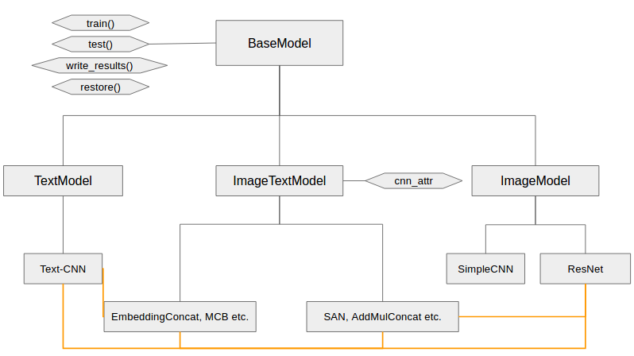

# VQAtoCQA
Code for the models developed in the paper: "From VQA to Multimodal CQA: Adapting Visual QA Models for Community QA Tasks", under review at AAAI.

Developed and tested with:
* Python 2.7
* Tensorflow 1.3

In this repository, we share the models we implemented. From the paper, we have:
* Image-only
* Text-CNN (from Kim 2014)
* Embedding-Concat
* Sum-Prod-Concat (Saito et al. 2017)
* Stacked Attention Network (Yang et al. 2015)
* Hierarchical Co-Attention (Lu et al. 2016)
* MCB without Attention (Fukui et al. 2016)
* Our Auxiliary Tasks Model
* Our Model with Global Image Weight

Our inheritance hierarchy is represented in a simplified manner by:

(The yellow links imply that the model acts as a component of the linked model.)

The instructions for running different models are provided in the file *run.py*.

Running the code on your own custom dataset requires change of file pathnames and the data size values.

For any questions, please do shoot me an email at avikalps@cs.cmu.edu.

Copyright (C) 2018 Yahoo Japan Corporation (Licensed under CC BY-NC-SA 4.0)
